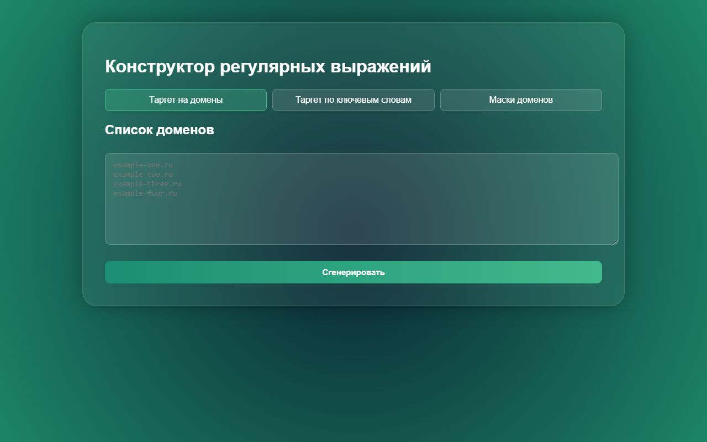
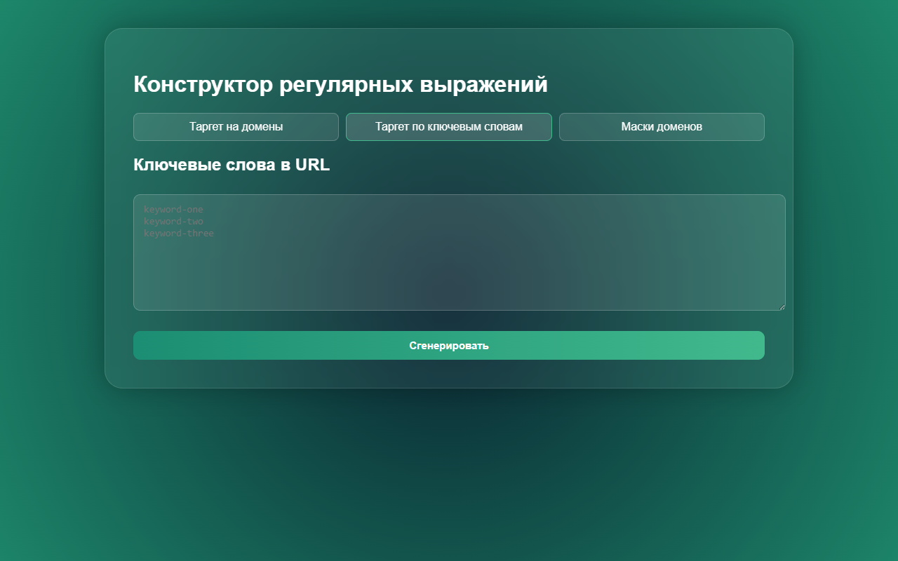
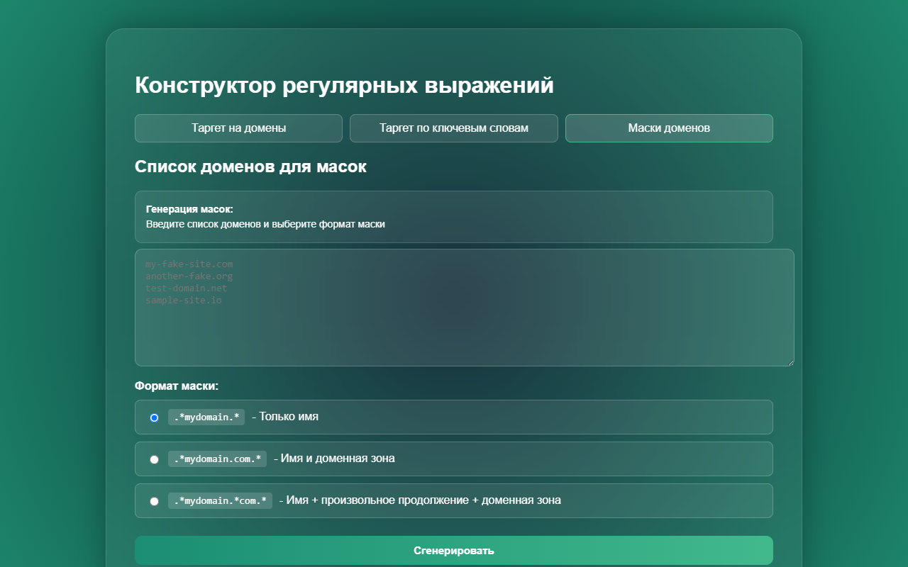

# 🔧 Конструктор регулярных выражений

## Генератор таргетов

> Инструмент для генерации регулярных выражений для работы с URL-адресами.

[](LICENSE)

---

## 📸 Интерфейс

**Таргет на домены**



**Таргет по ключевым словам**



**Маски доменов**



---

## ✨ Возможности

- Генерация таргетов на домены
- Генерация таргетов по ключевым словам
- Автоматическая генерация масок для включения/исключения доменов
- 3 формата масок: только имя, имя и доменная зона, имя с произвольным продолжением
- Копирование результатов в один клик
- Работает полностью в браузере, без серверной части
- Данные очищаются при обновлении страницы

---

## 🛠 Использование

### Таргет на домены

Вводите список доменов (по одному на строку):

```
example-one.ru
example-two.ru
example-three.ru
```

Результат:

```
^http[s]?:\/\/(.*\.)*(example-one\.ru|example-two\.ru|example-three\.ru)
```

### Таргет по ключевым словам

Вводите ключевые слова (по одному на строку):

```
keyword-one
keyword-two
keyword-three
```

Результат:

```
.*(keyword-one|keyword-two|keyword-three).*
```

### Маски доменов

Вводите список доменов и выбираете формат маски:

**Только имя** (`.*mydomain.*`):

```
my-fake-site.com
another-fake.org
```

Результат:

```
.*my-fake-site.*
.*another-fake.*
```

**Имя и доменная зона** (`.*mydomain.com.*`):

```
.*my-fake-site.com.*
.*another-fake.org.*
```

**Имя + произвольное продолжение + доменная зона** (`.*mydomain.*com.*`):

```
.*my-fake-site.*com.*
.*another-fake.*org.*
```

---

## 🚀 Запуск

1. Скачайте файл `index.html`
2. Откройте в браузере

Или используйте онлайн-версию через GitHub Pages.

---

## 📂 Структура

```
konstructor-regex/
├── index.html          # Основной файл
├── docs/
│   └── screenshots/    # Скриншоты интерфейса
├── .gitignore
├── LICENSE
└── README.md
```

---

## 📄 Лицензия

MIT
